# 🌐 Sajilo Sahayata

**A Disaster Reporting and Coordination System**  
_From Alert to Action Instantly_

[](https://react.dev/)
[](https://nodejs.org/)
[](https://www.mongodb.com/)
[](https://tailwindcss.com/)

---

## About the Project

**Sajilo Sahayata** is a real-time disaster management and coordination platform designed to minimize the time gap between incident reporting and government response. By connecting citizens, first responders, and local government officials on a single platform, the system ensures **faster alerts**, **smarter coordination**, and **timely actions** during emergencies.

### How It Works

When a user accesses the platform, the system automatically detects their current location and identifies the corresponding local government unit. Based on this information, it dynamically displays relevant alerts and emergency contact details specific to that area, enabling users to quickly access help during critical situations—regardless of where they are.

In addition, the platform offers:

- A **user dashboard** and **alert section** to monitor recent incidents and receive real-time updates
- An **interactive map** with intuitive icons that visually represent incident types and locations
- A comprehensive **admin dashboard** featuring data visualizations and charts for effective analysis and decision-making

> **Tagline:** From Alert to Action Instantly 🚨

---

## Features

- **Real-Time Alerts** — Instant notifications to authorities and citizens
- **Interactive Maps** — View incidents and clusters on a live map
- **Multi-Language Support** — Available in multiple local languages
- **User Authentication** — Secure sign-up and login for citizens and admins
- **Data Visualization** — Graphs and dashboards for incident analytics
- **Role-Based Access** — Different views for citizens and administrators
- **Custom Notifications** — Alerts based on location and incident type

---

## 🛠 Tech Stack

**Frontend:** React.js 18, Vite, Tailwind CSS  
**Backend:** Node.js, Express.js, MongoDB  
**Other Tools:** Zustand (State Management), Chart.js, Leaflet.js

---

## 📂 Project Structure

```bash
.
├── frontend   # React app
├── backend    # Node.js/Express server
└── README.md  # Project overview
```

## Screenshots

<h3>Logo</h3>
<div style="display: flex; gap: 10px; align-items: center; margin-bottom: 20px;">
  
  
</div>

<details>
  <summary><strong>User View (Tap to Expand)</strong></summary>
  <br />
  <div style="display: flex; flex-wrap: wrap; gap: 10px;">
    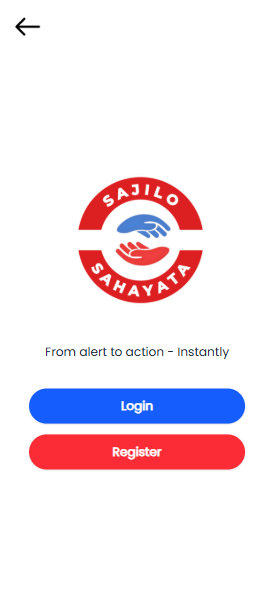
    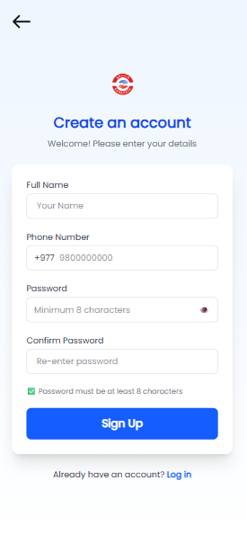
    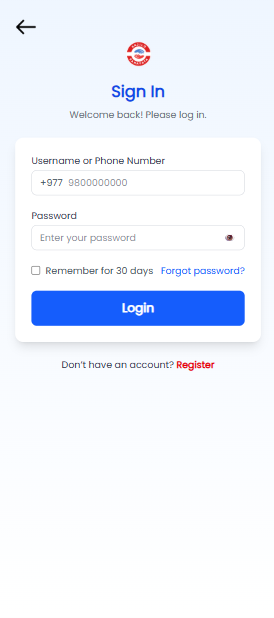
    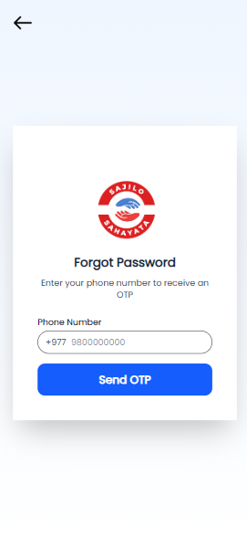
    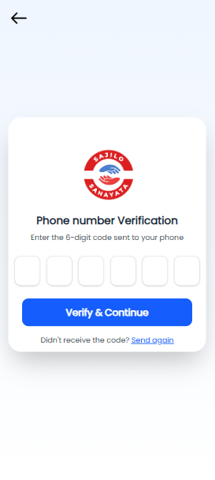
    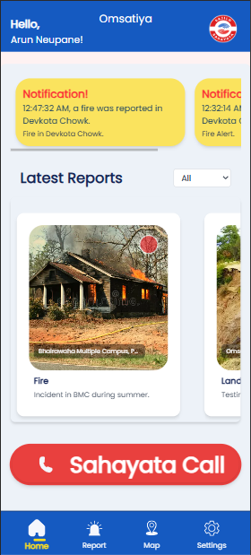
    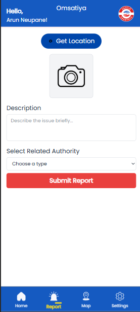
    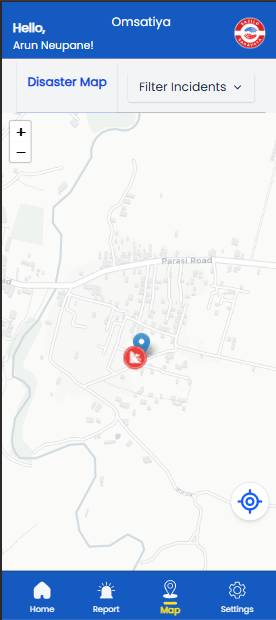
    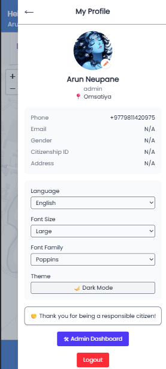
  </div>
</details>

<br />

<details>
  <summary><strong>Admin Panel (Tap to Expand)</strong></summary>
  <br />
  <div style="display: flex; flex-direction: column; gap: 15px;">
    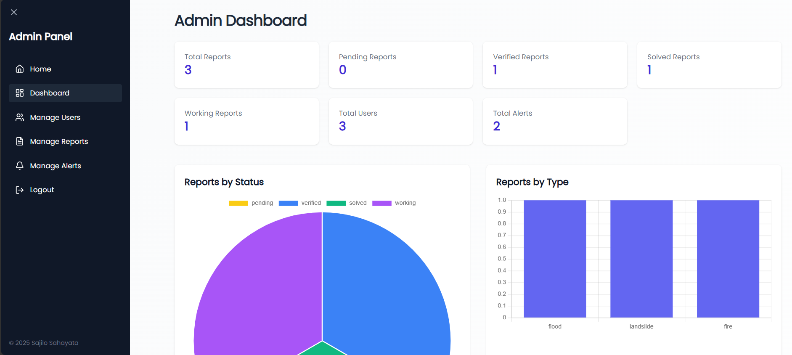
    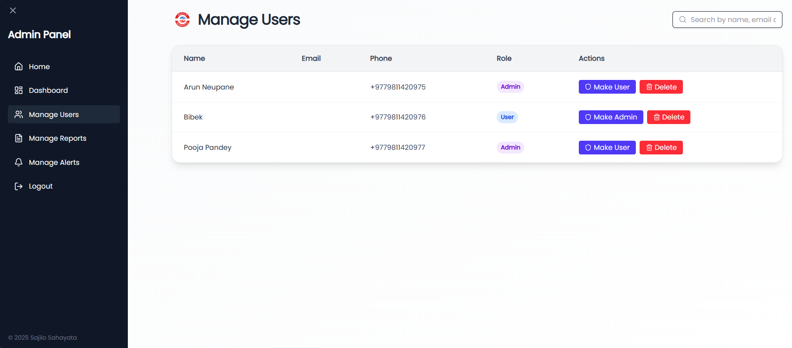
    
    
    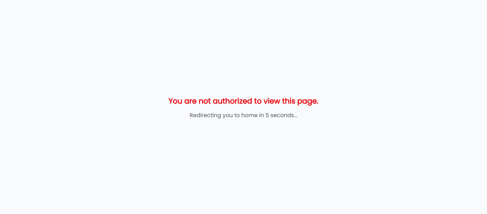
  </div>
</details>

### [Contact Me](https://arunneupane.netlify.app)

## Requirements

- Node.js v18+
- MongoDB Atlas or Local DB
- npm (v9+)

## How to Run

1. **Download the repository**

   - [Download ZIP](https://github.com/arundada9000/sajilo-sahayata/archive/refs/heads/main.zip), or
   - Clone with Git:
     ```bash
     git clone https://github.com/arundada9000/sajilo-sahayata.git
     ```

2. **Open the project**

   - Open the `frontend` and `backend` folders in **separate Visual Studio Code windows**.

3. **Install dependencies & run**

   - In **frontend folder**, run:
     ```bash
     npm install
     npm run dev
     ```
   - In **backend folder**, run:
     ```bash
     npm install
     npm run dev
     ```
   - Note: Create a .env file in the backend folder with the following:

   ```bash
   PORT=3000
   MONGO_URI=your-mongodb-connection-string
   JWT_SECRET=your-secret-key
   ```

4. **Need Help?**
   - Contact me on WhatsApp: **+977 9811420975**

## Contributing

Contributions are welcome!  
Please fork the repo and create a pull request.  
For major changes, open an issue first to discuss what you’d like to change.

---

## Project Background

### Academic Project & Hackathon Winner

**Sajilo Sahayata** began as a Final Year Project for the **BSc.CSIT** program and proudly won the **BMC InnovateX** hackathon competition. It showcases the potential of technology to streamline emergency response and coordination.

---

### Team Contributions

#### 🔹 Initial Prototype – _Team Emergex_

- **Aayush Chapagain** – UI/UX Design & Project Manager
- **Arun Neupane** – Frontend Development
- **Barsha Panthi** – UI/UX Design & Research
- **Bibek Bhusal** – Backend Development

    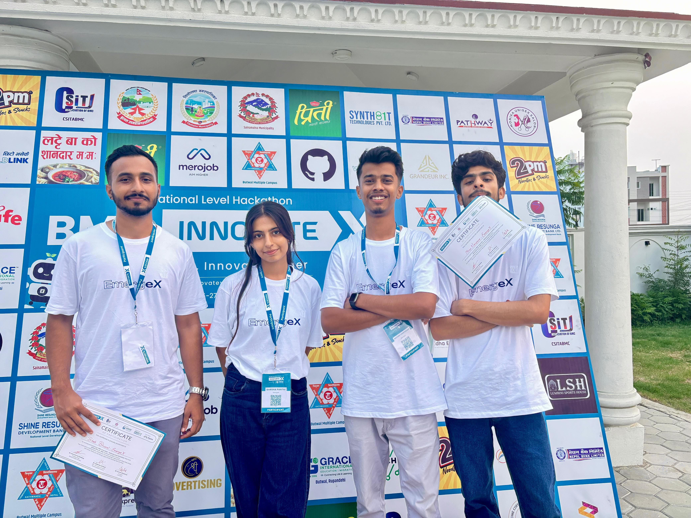

<details>
  <summary><strong>Team Emergex – View Team Photos</strong></summary>
  <br />
  <div style="display: flex; flex-wrap: wrap; gap: 10px;">
    
    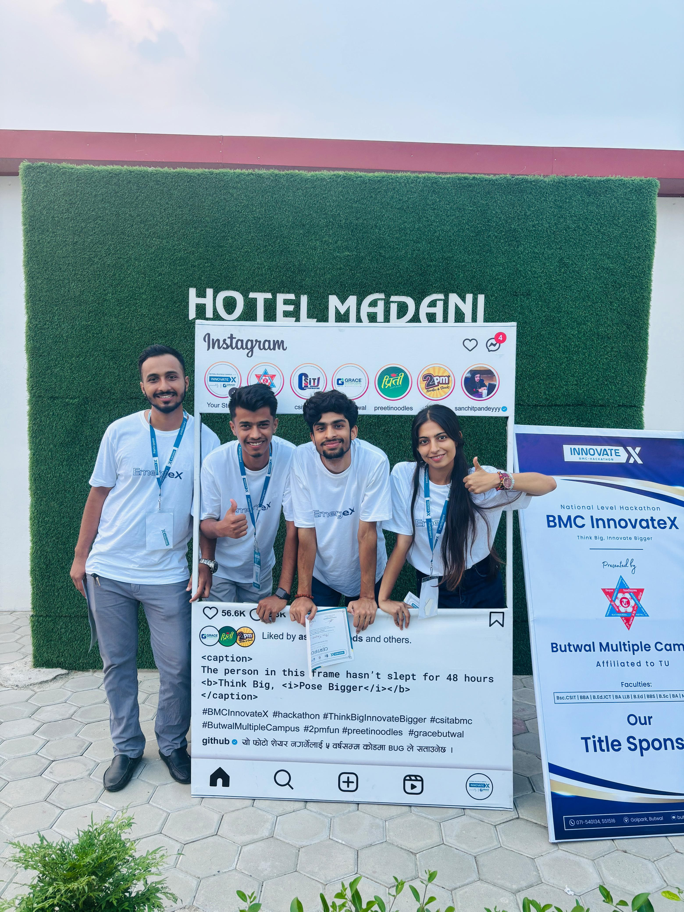
    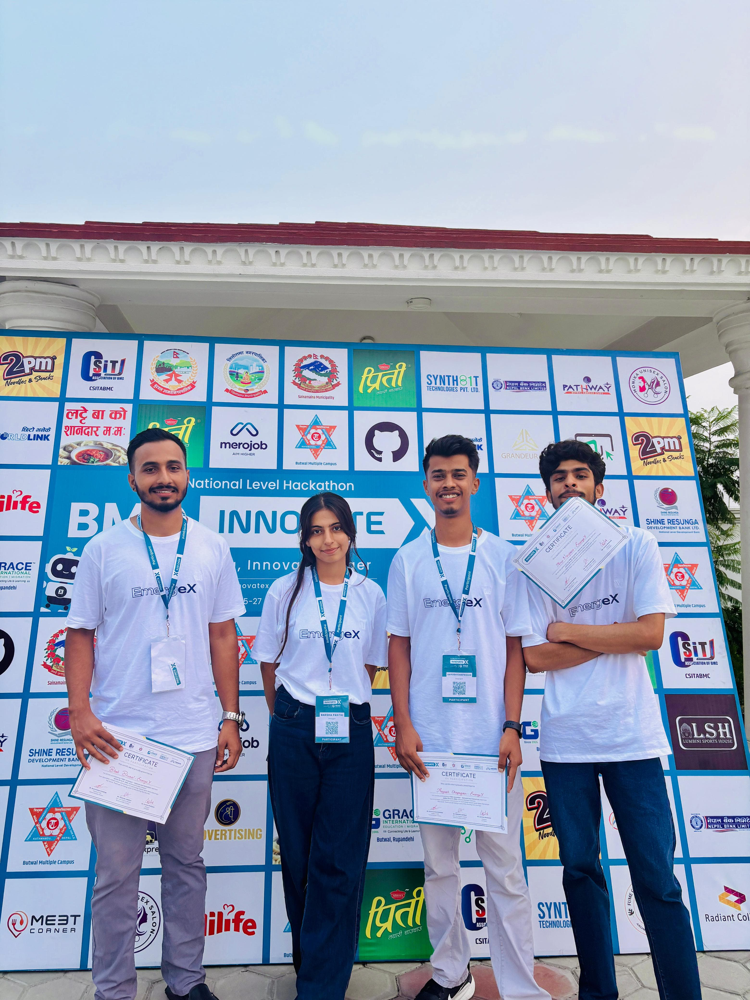
    
    
    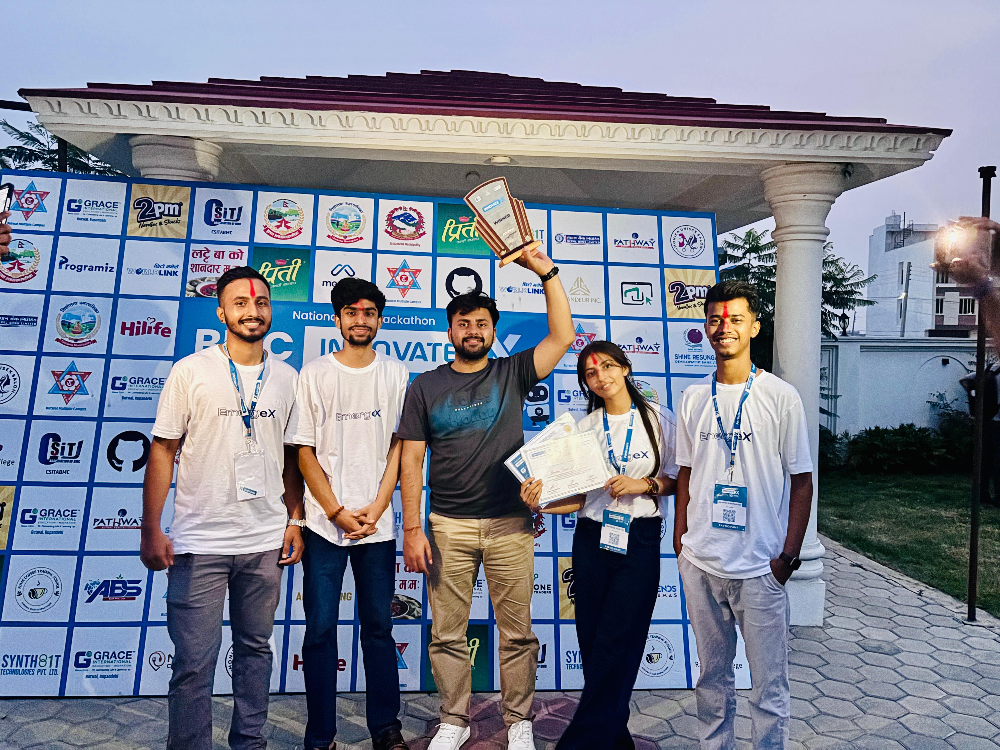
  </div>
</details>

#### Further Development – _Team BigAh_

- **Arun Neupane** – Full-Stack Development
- **Bijay Chaudhary** – Documentation & Reports
- **Sunil Paudyal** – Logistics & Coordination, Entertainment
- **Supervised by:** Mr. Suraj Pandey

    

---

## Acknowledgements

We would like to thank our mentors, supervisor, and supporters who guided us throughout this journey.

Special thanks to these technologies and tools:

- [React Leaflet](https://react-leaflet.js.org/)
- [TailwindCSS](https://tailwindcss.com/)
- [Firebase](https://firebase.google.com/)

---

## Contributing

Contributions are welcome! 🚀

To contribute:

1. Fork this repository
2. Create a new branch (`git checkout -b feature-name`)
3. Make your changes
4. Commit and push (`git commit -m "Add feature"` && `git push`)
5. Open a pull request

> For major changes, please open an issue first to discuss improvements or proposals.

---

## Contact

If you have questions, feedback, or ideas:

[Portfolio Website](https://arunneupane.netlify.app)
[](https://facebook.com/arunneupane9000)
[](https://instagram.com/arundada9000)
[](https://wa.me/+9779811420975)
[](mailto:arunneupane0000@gmail.com)
[](tel:+9779811420975)
[](https://youtube.com/@code_with_ease)

---

## Changelog

- v1.0.0 — initial release (August 2, 2025)

## Final Note

**Sajilo Sahayata** is more than a project — it's a vision for faster, smarter, and more localized disaster response. With continued improvements, we hope to empower citizens and first responders through real-time communication and coordination tools.

---

## License

This project is developed and maintained by **Arun Neupane**.  
It is intended for **educational and fair-use purposes only**.

For commercial use or redistribution, please reach out to me.

---
